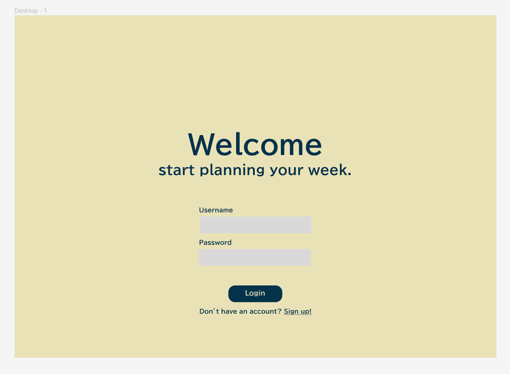
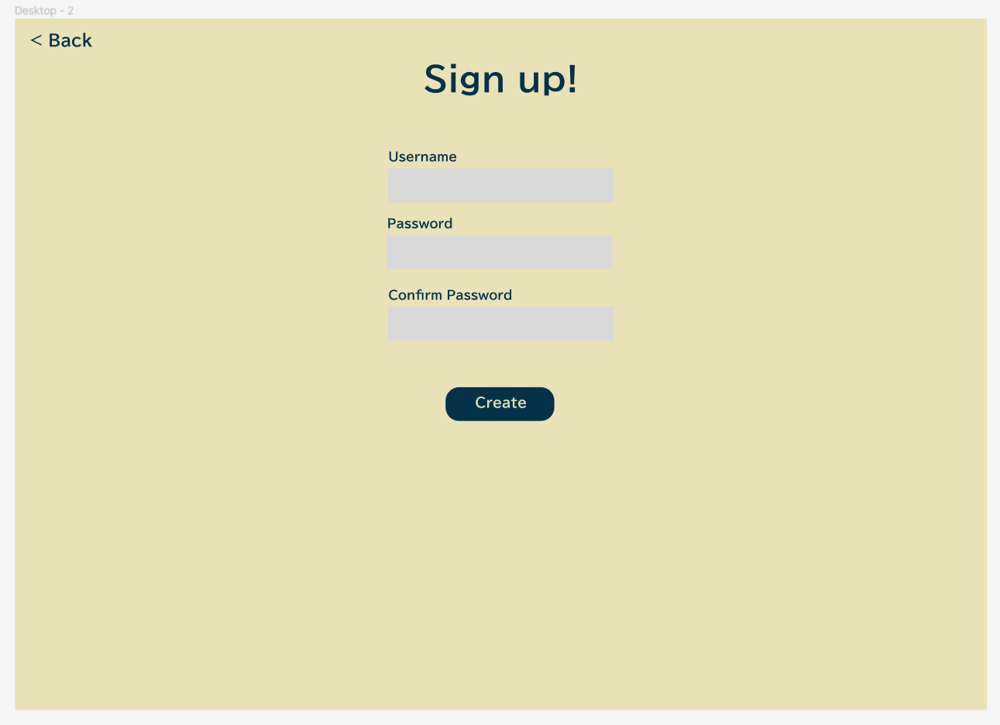
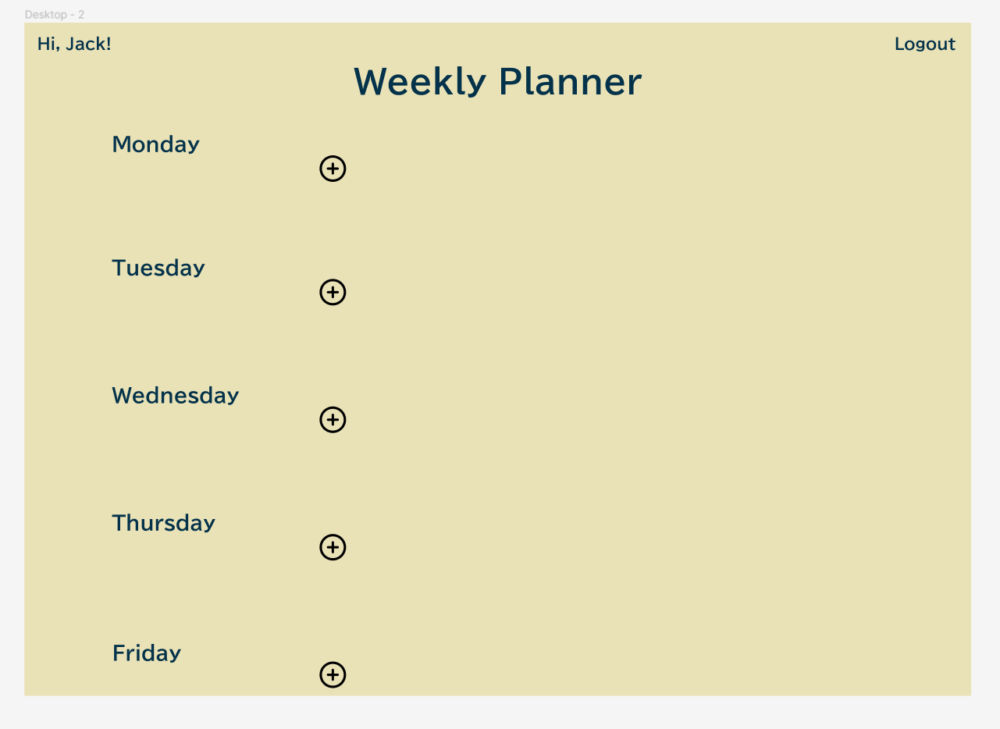
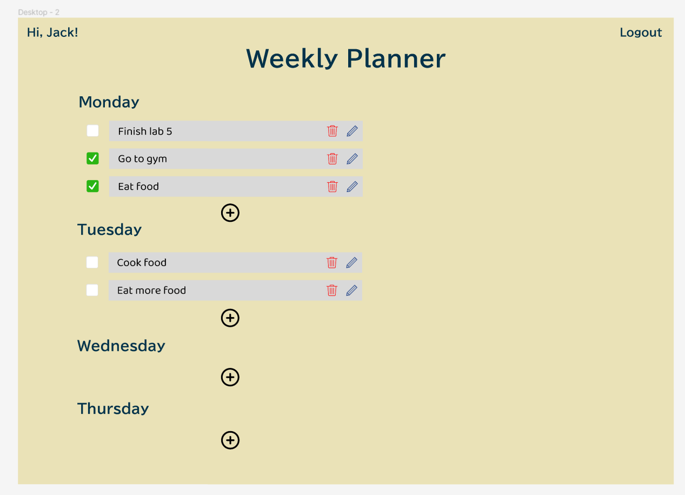
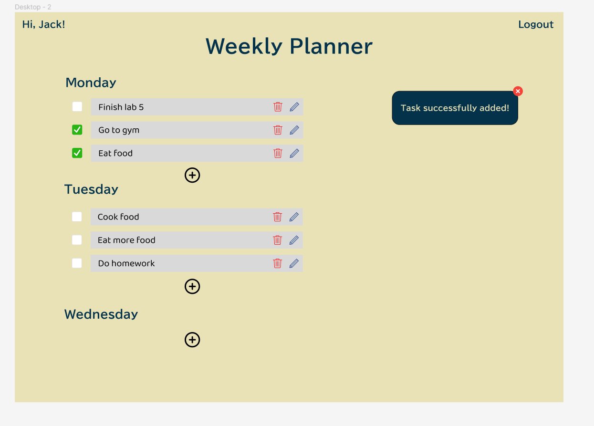

## Statement of Purpose

Most to-do list apps are just a list of tasks, sometimes ordered by date, but usually just 
a big list. Users may be able to separate tasks by categorizing them into different lists, 
but they are often not separated by week. These apps can be 
overwhelming - with the ability to plan tasks weeks or months into the future. However, 
to-do lists were originally used with the intent of jotting down quick tasks to be 
completed in a short span of time. The purpose of this web application is to visualize a to-do-list that users can create a weekly list of tasks, where they user can view their plans, check off completed tasks, update their schedule when plans have changed, and delete certain tasks for whatever reasons.
They get to focus on what they need to do in the current week and live in the current moment.  

## User Personas
**Persona Group**: student\
​
**Fictional Name**: Jane Smith\
​
**Occupation**: undergraduate student at UCSD\
​
**Demographics:**
* 21 years old
* pursuing bachelors degree in Computer Science

**Goals/Tasks:**
Taking multiple courses during studies, along with participating in extracurriculars such as clubs, sports, etc. Needs to:
* keep track of coursework and due dates
* tasks to complete for extracurriculars

​
**Environment:**\
Comfortable using a computer and an intermediate internet user. Has an internet connection at home and multiple devices with internet access. Uses email and the internet extensively as coursework is mostly submitted online these days. Internet-savvy usually means extremely discerning with the apps they will use - functionality and aesthetic are most important.
### Personal
The user can be anywhere between 10-80 years old. The application should be accessible to all, from schoolchildren to the elderly. Therefore, it should be easy to navigate, regardless of level of education.
### Professional
As a web application, it can only be used by those with access to the internet and personal devices with such access. It will most likely be used by those with regular weekly schedules, with multiple tasks to be completed each week, including students, professionals, and many more.
### Technological
A regular user would typically be using both a laptop and a smartphone. Today, both school and work are integrated with the internet and various productivity apps - Zoom, Google Classroom, Canvas, Slack, etc. Such applications usually have both a mobile and desktop interface.
### Motivation
Users will most likely be motivated by a need to stay on top of their tasks - a way to look at the upcoming week at a glance and how busy they will be during the week.
## Constraints 
-  Must be a local-first web application that has CRUD operation.
- No framework and firebase allowed
- Focus on HTML, CSS, JavaScript
- Only have 5 weeks to complete

## Solution
 - Our objective is to create a web-based to-do list app with a weekly view, short enough so that users do not get overwhelmed, but enough to stay focused on upcoming tasks.
- Users can mark tasks as completed, edit task, and/or delete the tasks from the list. The application should create a weekly list of tasks, where they user can view their plans, check off completed tasks, update their schedule when plans have changed, and delete certain tasks for whatever reasons.
- After log in, they will land on their planner/page to see their todo list and add tasks to each day of the week and modify their tasks

 
---
## App Diagram
 

 

## UI Design

---

## Risk and Rabbit Holes

1. Communication in the group project is very crucial, report progress and obstacles on time can avoid potential delay. If one member stuck at some point and did not report on time, then it could slow down the entire progress. Therefore, we ask everyone to do a standup notes each day at 11 am and have weekly meeting.
​
2. Improper task assignment may lead to inefficient work. We ensure each member get similar amount of workload by estimating expected time spent for each task.
​
3. While design the project, it can not have complicated or too many features since there are limited time to work on it. We restrict the task user can add to be daily or weekly task for MVP. By doing so, we don’t need to handle invalid date selection and a calendar view by limits the range of selection. Also, we will not develop the users interaction or social features for MVP due to the limited time.
​
4. if two user are sign up account with same user name at the same time, may cause conflicts, so we may randomly generate user name for them when user sign up new account.
​
5. Everytime user modify their to-do list, we need to update the database, and there might be some latency on either user end or local database, and we may need to delay app close time to make sure everything is saved.
​
6. Since we are using local based database, we may lost all the data if the machine broken, so we need to backup regularly with database system we are using.
​
7. Developing a sophisticated database to store and query the user data may take extra time. We will probably consider to limit the details user can add to task.

---

## Things to avoid / Limitations /simplification 

1. ability to share/post to-do lists on social media
2. calender set-up
3. implementing deadlines notification
4. focusing too much on how the web app looks
5. making the web app secure 
6. poor navigation, hidden elements
7. unclear/confusing user interface
8. too many steps or instructions
9. user's ability to create customized list
10. user's ability to drag and move their created list to another day of the week
11. user's ability to set deadlines further in the future other than a day of the week
12. multiple list options
13. user's ability to customize their font
14. user's ability to upload images to their to-do list
15. user predictability (the app suggesting tasks to add to to-do list)
16. celebration (ex: confetti) when the user finishes a task (assuming users can check off tasks)
17. autocorrection on text
18. user's ability to set priority amongst tasks
19. user's ability to create folders of different to-do lists
